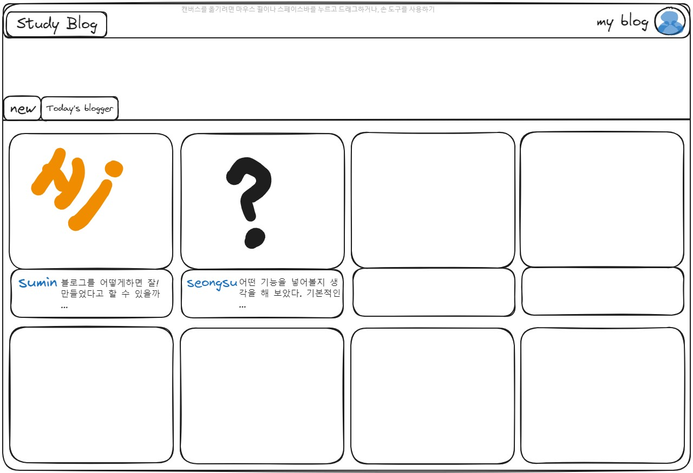

# 학습블로그 계획

## 페이지 디자인

## 목적

- 사용자가 학습한 기록을 개인 블로그에 업로드하여 하나의 페이지로 볼 수 있고, 다른 사용자의 학습 기록도 볼 수 있습니다.

## 사용자 스토리

- 블로그를 이용하는 유저가 자신의 계정을 만들 수 있습니다.
- 유저는 자신이 공부한 기록을 업로드 할 수 있습니다.
- 다른 유저의 블로그를 팔로우하고 나의 블로그 팔로잉을 볼 수 있습니다.
- 다른 유저의 글을 좋아요하고 댓글을 기록 할 수 있습니다.
- 유저는 자신의 정보를 수정 할 수 있습니다.
- 자신이 기록한 글을 수정, 삭제, 보관 할 수 있습니다.

## 기능

- 회원가입, 로그인, 마이페이지 수정, 개인블로그 편집
- 글 등록, 좋아요 표시, 댓글 등록
- 이미지 첨부, 링크 첨부, 이모티콘 첨부, 코드 작성
- 팔로워, 팔로잉
